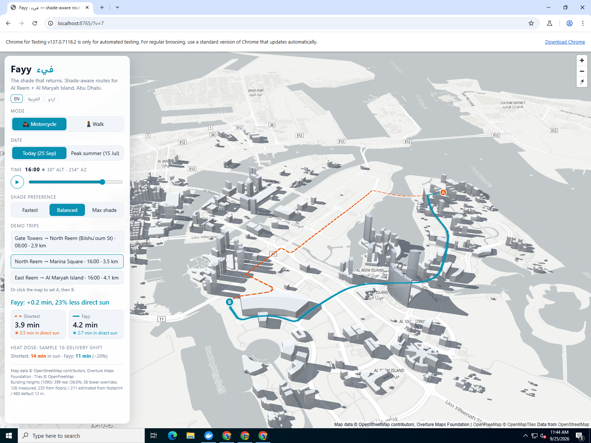

# Fayy · فيء

**Shade-aware routes for Abu Dhabi delivery riders and pedestrians, on Al Reem and Al Maryah Island.** Pick A → B, a time and a mode; Fayy computes where every building's shadow falls at that minute and shows the shortest route next to the shadiest one (e.g. by motorcycle from Gate Towers to north Reem at 08:00, 2.9 km: "Fayy: +0.2 min, 40% less direct sun").

*Fayy (فيء) is Arabic for the shade that returns after the sun passes its peak.* Built at Fish Tank Abu Dhabi.

**Live demo:** https://mooda420.github.io/Fayy/ (GitHub Pages, served from `/docs` on `main`)



## How it works
1. **Sun position** — `pvlib` computes solar altitude/azimuth at the bbox centre every 30 min (06:00–18:30, UAE time UTC+4, tz `Asia/Dubai`) for two dates: *Today* (2026-09-25) and *Peak summer* (2026-07-15).
2. **Shadow geometry** — each building is an extruded footprint of height *h*. Its ground shadow is the union of the footprint, the footprint translated by `L = h / tan(alt)` (capped at 600 m) away from the sun (`dx = −L·sin(az)`, `dy = −L·cos(az)`), and the quadrilateral swept by every footprint edge. This is exact for concave footprints too. All shadows are unioned per slot (`shapely.union_all`) and simplified at 1 m. Sun ≤ 2° ⇒ everything is shade.
3. **Edge exposure** — for every street edge and slot, `sun_fraction = length outside shadow / edge length` (STRtree + vectorised shapely).
4. **Exposure-weighted routing (in the browser)** — Dijkstra over the precomputed graph JSON with `cost = time_s × (1 + k × sun_fraction)`; k = 0 (Fastest), 3 (Balanced), 8 (Max shade). The shortest-by-time route (orange, dashed) is always shown next to the Fayy route (cyan).

Everything at demo time is static: HTML + vanilla JS + MapLibre GL JS + OpenFreeMap tiles + precomputed JSON in `docs/data/`. No API keys, no backend.

### Features
- 🏍️ Motorcycle (default, one-way aware drive + service roads, osmnx speeds, fallback 40 km/h, capped 60 km/h) / 🚶 Walk (1.3 m/s).
- 3D extruded buildings + live shadow layer, time slider and ▶ Play (shadows sweep across the day and routes re-compute live).
- Result card: travel time and minutes in direct sun for both routes + headline.
- Midday banner when almost no shade exists (outdoor-work ban reminder, 12:30–15:00, 15 Jun–15 Sep).
- Stretch goals done: ◆ shaded rider waiting spots within 150 m of B, EN / العربية / اردو toggle, heat-dose estimate for a 10-delivery shift.

## Height coverage (the biggest data risk)
From `docs/data/stats.json` (Overture buildings, Al Reem Island bbox):

| Buildings | Tower override (CTBUH) | Overture/OSM `height` | From `num_floors` × 3.2 m | Estimated from footprint | Default 12 m |
|---|---|---|---|---|---|
| 1090 | 38 | 126 | 235 | 211 | 480 |

**399 real (36.6%) / 211 estimated (19.4%) / 480 default (44.0%).** The 40 tallest completed towers in the bbox are in `data/overrides/heights_override.csv` with their CTBUH Skyscraper Center heights and a `source` column; 38 of them matched a footprint by name or location (the footprint containing the CTBUH point, or the nearest one within 40 m that is at most 6,000 m²). Buildings with no height data get a footprint estimate: over 1,500 m² → 60 m, 600–1,500 m² → 40 m, under 600 m² → 12 m (the last group is counted as *default*). The remaining 12 m buildings are small low-rise, podium or utility structures.

## Re-running the pipeline
```bash
python -m venv .venv && .venv/Scripts/activate   # or source .venv/bin/activate
pip install -r requirements.txt
python pipeline/run_all.py          # fetch + shadows + exposure + export (≈2 min)
python pipeline/run_all.py --skip-fetch   # reuse data/interim
pytest tests
```
Dates, slots, bbox and speeds live in `pipeline/config.py`. Serve locally with `python -m http.server -d docs`.

## Repo layout
```
pipeline/  config.py fetch_data.py shadows.py exposure.py export.py run_all.py
data/overrides/heights_override.csv   # key (name), height_m, lat, lon, source
docs/      index.html app.js style.css data/   # the static site
tests/test_shadows.py
```

## Assumptions
- **Area**: Al Reem Island + Al Maryah Island (ADGM / Hub71 / Galleria), Abu Dhabi, moved from Dubai Marina + JBR at the user's request. Bbox `54.378, 24.480, 54.425, 24.512`. Its western edge also takes in a strip of Abu Dhabi island (Al Zahiyah / Tourist Club). The timezone is still UTC+4 (the tz name is `Asia/Dubai`, which covers the whole UAE).
- **Overpass**: if `overpass-api.de` is unreachable, set `OVERPASS_URL=https://maps.mail.ru/osm/tools/overpass/api` (a free public mirror) before running the pipeline.
- **Overture download** uses `overturemaps download --no-stac` (the STAC index returned "no data" for this bbox on the 2026-08/09 releases). OSM buildings are the fallback, and are also used to fill heights for Overture buildings that lack them (≥50% footprint overlap).
- **Height rule order**: tower override (by name, Overture id, or lat/lon) → Overture `height` (plus OSM fill) → `num_floors × 3.2 m` → footprint-area estimate (60 m / 40 m) → default 12 m. The override goes first so the published CTBUH architectural heights win. The footprint estimate is a rough proxy; a large low mall footprint can come out too tall.
- **Motorcycle graph** uses osmnx `drive_service` (drive + service roads, which riders use for building drop-offs), directed, largest strongly connected component. Walk graph: largest connected component, edges treated as bidirectional.
- Ground is flat; shadows are cast onto the ground only (no terrain, no trees, no metro viaduct or bridges, no arcades/covered walkways). Building footprints are treated as shade (you can't be inside them).
- Sun position computed once at the bbox centre (the error across ~3.5 km is negligible).
- Shadows beyond the bbox are clipped naturally only by the data extent; tall towers near the edge still cast full-length shadows.
- "Minutes in direct sun" = Σ edge travel time × sun fraction, at the selected slot for the whole trip (no time-progression within a trip).
- Heat dose = 10 deliveries alternating A→B / B→A in consecutive half-hour slots from the selected time.
- Preset trip names are approximate landmark labels; each preset also sets its time slot (08:00 or 16:00), and points snap to the nearest graph node.
- Needs WebGL (MapLibre). Leaflet fallback was not needed.

## Next
- Fleet heat-dose API for delivery platforms (Talabat, Deliveroo, Noon) to schedule and route riders by cumulative sun exposure.
- Shaded waiting spots for riders near restaurants (crowd-sourced + computed).
- Full Arabic / Urdu / Hindi UI.
- Live temperature / UV (WBGT) weighting instead of binary sun/shade.
- Trees, arcades, metro viaduct and bridge shade; LiDAR/3D-tiles heights.

## Attribution
Map data © OpenStreetMap contributors, Overture Maps Foundation. Tiles © OpenFreeMap / OpenMapTiles. Built with MapLibre GL JS, osmnx, shapely, pvlib.
